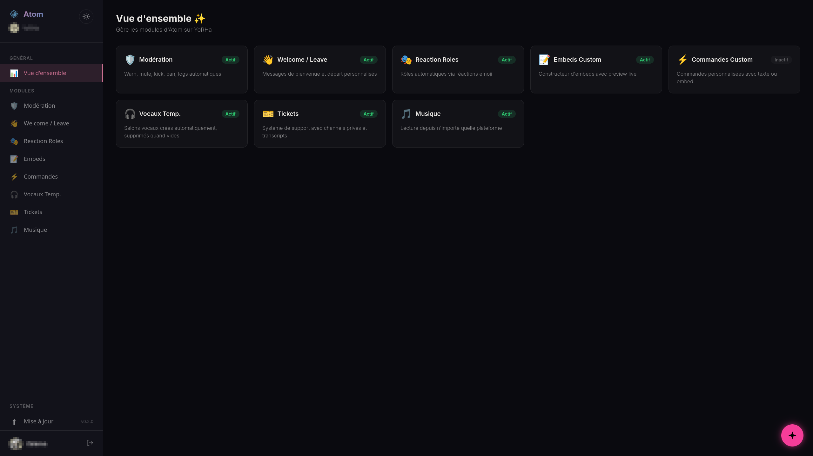

# 🌌 Quasar — Bot Discord Self-Hosted

> Toutes les fonctionnalités premium d'un bot Discord — modération, tickets, reaction roles, embeds, TempVoice et dashboard web. 100% self-hosted, open source, 0 abonnement.



---

## ✨ Features

| Module | Description |
|--------|-------------|
| 🛡️ **Modération** | Warn, mute, kick, ban, clear, historique des sanctions, logs automatiques |
| 🤖 **Modération auto** — *bêta* | AutoMod de Discord piloté depuis le dashboard, escalade par avertissements, anti-raid, salon piège et arbitrage. Tout arrive désactivé |
| 👋 **Welcome / Leave** | Messages de bienvenue et départ avec embed + avatar |
| 🎭 **Reaction Roles** | Panels avec emojis, mode unique ou multiple, toggle au clic |
| ✅ **Autoroles** | Rôles attribués automatiquement à l'arrivée |
| 🔊 **Rôles vocaux** | Rôle donné en vocal, retiré à la déconnexion |
| 📝 **Embeds Custom** | Créer, sauvegarder et envoyer des embeds personnalisés |
| ⚡ **Commandes Custom** | Commandes personnalisées avec texte ou embed |
| 🎫 **Tickets** | Système de tickets, panel personnalisable — transcript envoyé dans Discord à la fermeture, jamais stocké en base |
| 🔊 **TempVoice** | Salons vocaux temporaires avec boutons interactifs |
| 🌐 **Dashboard Web** | Tout configurer depuis un navigateur — thème clair/sombre |
| ⬆ **Auto-update** | Mise à jour en un clic depuis le dashboard avec logs temps réel |
| ⚖️ **Droits des personnes** | `/mes-donnees`, demandes de suppression routées à l'administrateur, notification de violation de données, contrat de sous-traitance sur instance publique |

---

## 🚀 Quick Start

### Prérequis
- [Docker](https://docs.docker.com/get-docker/) installé
- Une application bot Discord ([Developer Portal](https://discord.com/developers/applications))

### Installation en une commande

```bash
curl -sSL https://raw.githubusercontent.com/venaciteam/quasar/main/install.sh | bash
```

Ou manuellement :

```bash
git clone https://github.com/venaciteam/quasar.git
cd quasar
./setup.sh
```

Le script te guide : il demande tes identifiants Discord, crée le `.env`, le volume Docker, build et lance le bot. C'est tout.

### Installation manuelle

<details>
<summary>Voir les étapes manuelles</summary>

#### 1. Cloner le repo

```bash
git clone https://github.com/venaciteam/quasar.git
cd quasar
```

#### 2. Configurer

```bash
cp .env.example .env
```

Édite le fichier `.env` avec tes informations :

| Variable | Description |
|----------|-------------|
| `DISCORD_TOKEN` | Token du bot (onglet Bot du Developer Portal) |
| `DISCORD_CLIENT_ID` | Client ID (onglet OAuth2) |
| `DISCORD_CLIENT_SECRET` | Client Secret (onglet OAuth2) |
| `CALLBACK_URL` | URL de callback OAuth2 — `http://localhost:3000/callback` par défaut. Si tu ouvres le dashboard au réseau, mets l'IP du serveur (ex: `http://192.168.1.100:3000/callback`) |
| `JWT_SECRET` | Chaîne aléatoire pour signer les JWT (génère avec `openssl rand -hex 32`) |
| `PORT` | Port du dashboard (défaut: `3000`) |
| `BIND_ADDRESS` | **Exposition du dashboard en Docker** — `127.0.0.1` (défaut) = accessible seulement depuis la machine hôte, `0.0.0.0` = ouvert au réseau |
| `DASHBOARD_HOST` | Équivalent hors Docker (lancement direct par `node index.js`). Ne pas y toucher en conteneur : le Dockerfile le force à `0.0.0.0` |
| `BOT_OWNER_ID` | Ton ID Discord — active les fonctions admin dans le dashboard (gestion du statut du bot). Pour le trouver : active le mode développeur dans Discord → clic droit sur ton profil → Copier l'identifiant |
| `INSTANCE_OPERATOR_NAME` | Qui héberge cette instance — affiché dans le badge de version, sur toutes les pages du dashboard (optionnel) |
| `INSTANCE_LEGAL_URL` | Lien vers tes mentions légales (optionnel) — affiché au même endroit |
| `CONTRACT_PUBLIC_URL` | Lien vers ton contrat de sous-traitance, **utilisé uniquement en `QUASAR_MODE=public`**. Vide : le contrat de l'instance Venacity |
| `INSTANCE_SOURCE_URL` | Code source de ta version — **requis par l'AGPL si tu as modifié Quasar et que ton dashboard est accessible à d'autres** |
| `ABUSE_REPORT_URL` | Où reçois-tu les signalements d'abus (`/signaler abus`). **Vide par défaut** : sans ça, aucun signalement d'abus ne quitte ton instance |
| `INSTANCE_ABUSE_CONTACT` | Contact affiché pour signaler un abus quand `ABUSE_REPORT_URL` est vide (e-mail ou URL) |
| `REPORT_RELAY_URL` | Où partent les bugs du logiciel (`/signaler bug`). Défaut : `https://sema.vena.city` |
| `INCIDENT_WEBHOOK_URL` | Webhook Discord où ton instance annonce ses propres incidents techniques (erreur inattendue, promesse rejetée). **Vide par défaut** : les incidents restent alors dans les journaux |
| `GUILD_PURGE_GRACE_DAYS` | Délai avant suppression des données d'un serveur quitté (défaut : `7` jours, `0` = immédiat) |
| `QUASAR_ADMIN_API_KEY` | Clé d'administration du journal des nouveautés (`/api/admin/nouveautes`). **Vide par défaut** : sans elle, ces routes répondent 503 et rien ne peut être publié |
| `STRIPE_LINK_ONCE_2` &nbsp;·&nbsp; `_5` &nbsp;·&nbsp; `_CUSTOM` | Liens de paiement ponctuels de la page `/soutenir`. Chacun est optionnel : un lien absent masque son bouton |
| `STRIPE_LINK_MONTHLY_2` &nbsp;·&nbsp; `_5` &nbsp;·&nbsp; `_10` | Idem pour les soutiens mensuels. Si **aucun** lien n'est défini, `/soutenir` bascule d'elle-même en mode « bientôt » |

> **🔒 Le dashboard est fermé par défaut** — Il n'écoute que sur la machine qui l'héberge. C'est volontaire : le dashboard donne accès à toute la configuration du bot et aux données de tes serveurs (sanctions, tickets, configs). Tant que tu n'y touches pas, personne d'autre sur ton réseau ne peut l'atteindre.
>
> **Pour l'ouvrir au réseau local**, en connaissance de cause :
> 1. `BIND_ADDRESS=0.0.0.0` dans le `.env` (ou `DASHBOARD_HOST=0.0.0.0` si tu lances sans Docker)
> 2. `CALLBACK_URL=http://<ip-de-ton-serveur>:3000/callback` — l'IP est affichée dans les logs au démarrage
> 3. Ajoute cette même URL dans le Developer Portal (OAuth2 → Redirects)
>
> **Pour un accès depuis Internet**, ne publie jamais le port directement : passe par un reverse proxy HTTPS (Cloudflare Tunnel, Nginx, Caddy…) et laisse `BIND_ADDRESS=127.0.0.1` — le proxy tourne sur la même machine et atteint le dashboard en local.

#### 3. Configurer le bot Discord

Voir [Configurer le bot Discord](#configurer-le-bot-discord) juste après ce bloc — intents à activer, réglages à laisser tranquilles.

#### 4. Créer le volume et lancer

```bash
docker volume create quasar-data
docker compose up -d
```

Le bot est en ligne. L'adresse du dashboard (locale + réseau) s'affiche dans les logs : `docker logs quasar`.

</details>

### Configurer le bot Discord

Sur le [Developer Portal](https://discord.com/developers/applications) :

**Onglet Bot — à activer.** Les 3 Privileged Gateway Intents. Quasar les demande tous les trois au démarrage : s'il en manque un, Discord refuse la connexion et le bot ne démarre pas.
- ✅ Presence Intent
- ✅ Server Members Intent
- ✅ Message Content Intent

> Quasar demande aussi deux intents liés à l'AutoMod de Discord (`AutoModerationConfiguration` et `AutoModerationExecution`). Ils ne sont **pas** privilégiés : ils n'apparaissent nulle part dans le Developer Portal, et il n'y a rien à activer ni à faire approuver.

**Onglet Installation.** Garde **Guild Install**, décoche **User Install** : Quasar est un bot de serveur. Mets *Install Link* sur **None** — l'invitation se fait avec l'URL de la section suivante.

**Onglet Bot — à désactiver.** Dans cet ordre, après l'onglet Installation :
- ❌ **Public Bot** — sauf si tu veux que n'importe qui puisse inviter ton bot sur son serveur
- ❌ **Requires OAuth2 Code Grant** — activé, l'invitation du bot échoue

> [!tip]
> Si Discord refuse de décocher *Public Bot* avec le message *« Private application cannot have a default authorization link »*, c'est que *Install Link* n'est pas encore sur **None** : il faut passer par l'onglet Installation d'abord, enregistrer, puis revenir. La mention *« Verified apps must be public »* ne concerne que les applications vérifiées par Discord.

**Onglet OAuth2 → Redirects.** Ajoute ton callback URL, identique au caractère près à `CALLBACK_URL` dans ton `.env` (ex: `http://localhost:3000/callback`). Discord rejette la connexion à la moindre différence, slash final compris.

> [!warning]
> **Ne remplis jamais « Interactions Endpoint URL »** (onglet General Information). Ce champ bascule Discord en mode HTTP : il cesse d'envoyer les interactions par la passerelle, et **plus aucune commande slash ne répond** — alors que le bot semble connecté et que rien n'apparaît dans les logs. Quasar écoute la passerelle, ce champ doit rester vide.

### Inviter le bot

Sur le Developer Portal → **OAuth2 → URL Generator** :
- Scopes : `bot` + `applications.commands`
- Permissions : `Administrator`
- Copie l'URL et ouvre-la pour inviter le bot sur ton serveur

Le dashboard génère aussi cette URL pour toi, une fois le bot lancé.

> Pourquoi Administrator : ça évite de revenir ajuster les permissions à chaque module activé. Si tu préfères le principe du moindre privilège, voici le minimum, et à quoi sert chaque permission :
>
> - **Gérer les salons** — tickets et salons vocaux temporaires ;
> - **Gérer les rôles** — autoroles, reaction roles, rôles vocaux ;
> - **Gérer les messages** — `/clear` ;
> - **Expulser des membres** — `/kick` et les expulsions automatiques ;
> - **Bannir des membres** — `/ban`, mais aussi vérifier quels bannissements sont encore en vigueur avant de purger d'anciennes sanctions, et lever un bannissement temporaire à son échéance ;
> - **Modérer les membres** — toutes les exclusions temporaires : `/mute`, l'escalade par avertissements, l'anti-raid, et celles posées par une règle AutoMod ;
> - **Gérer le serveur** — tout ce qui touche à l'AutoMod de Discord, **y compris la simple lecture de tes règles**, et la mise en pause des invitations du mode panique anti-raid.
>
> Les deux dernières sont les plus faciles à oublier, et ce sont celles qui rendent la modération automatique inopérante. Sans **Gérer le serveur**, l'onglet AutoMod du dashboard refuse d'afficher quoi que ce soit — il te dit au moins laquelle activer —, et le mode panique de l'anti-raid échoue sans rien dire ailleurs que dans les logs du bot. Sans **Modérer les membres**, aucune exclusion temporaire n'est possible : ni `/mute`, ni un palier d'escalade, ni une règle AutoMod qui exclut.

---

## 🍓 Raspberry Pi

Quasar tourne confortablement sur un **Raspberry Pi 4** (2 Go minimum). La stack est légère : Node.js + SQLite, pas de base de données externe.

```bash
curl -sSL https://raw.githubusercontent.com/venaciteam/quasar/main/install.sh | bash
```

> **Note :** Le build initial peut prendre quelques minutes sur Pi (compilation du module natif `better-sqlite3`).

---

## 🔧 Commandes

<details>
<summary>Voir toutes les commandes (26 déployées)</summary>

### Modération
| Commande | Description |
|----------|-------------|
| `/warn @membre [raison]` | Avertir un membre |
| `/warns @membre` | Voir les warns |
| `/unwarn [id]` | Retirer un warn |
| `/mute @membre [durée] [raison]` | Timeout (10m, 2h, 1d) |
| `/unmute @membre` | Retirer le timeout |
| `/kick @membre [raison]` | Expulser |
| `/ban @membre [raison]` | Bannir |
| `/unban [id]` | Débannir |
| `/clear [nombre] [@membre]` | Supprimer des messages |
| `/sanctions @membre` | Historique complet |
| `/log #channel` | Définir le channel de logs |
| `/unlog` | Retirer les logs |

### Welcome / Leave
| Commande | Description |
|----------|-------------|
| `/welcome channel/message/embed/test/off` | Configurer les messages de bienvenue |
| `/leave channel/message/embed/test/off` | Configurer les messages de départ |

### Rôles
| Commande | Description |
|----------|-------------|
| `/autorole add/remove/list` | Rôles automatiques à l'arrivée |
| `/reactionrole create/add/remove/delete/list` | Panels de reaction roles |
| `/voicerole set/remove/list` | Rôles vocaux |

### TempVoice
| Commande | Description |
|----------|-------------|
| `/tempvoice setup [catégorie]` | Configurer les salons vocaux temporaires |

### Tickets
| Commande | Description |
|----------|-------------|
| `/ticket setup` | Configurer le système de tickets |
| `/ticket close [raison]` | Fermer un ticket |
| `/ticket add @membre` | Ajouter un membre au ticket |
| `/ticket remove @membre` | Retirer un membre du ticket |
| `/ticket config` | Personnaliser le panel |

### Embeds & Commandes
| Commande | Description |
|----------|-------------|
| `/embed create/send/edit/preview/list/delete` | Embeds personnalisés |
| `/cmd create/edit/delete/list` | Commandes personnalisées |

### Utilitaire
| Commande | Description |
|----------|-------------|
| `/help` | Aide, liste des commandes et moyens de signalement |
| `/ping` | Latence du bot |

### Signalement et données personnelles — accessible à tous les membres
| Commande | Description |
|----------|-------------|
| `/signaler bug` | Quasar dysfonctionne — part chez qui développe le bot |
| `/signaler abus` | Le bot est utilisé de façon abusive — reste chez l'hébergeur de l'instance |
| `/mes-donnees` | Voir les données que Quasar traite te concernant sur ce serveur, et demander leur suppression |

</details>

---

## 🤖 Modération automatique — *bêta*

Une page « Modération auto » du dashboard, quatre onglets, quatre protections indépendantes. Elles sont **livrées en bêta** et **arrivent toutes désactivées** : une instance qui se met à jour ne se réveille pas en sanctionnant. Chaque onglet propose un mode « alerte seule », sans aucune sanction associée — c'est par là qu'il faut commencer.

Le détail des réglages se fait dans le dashboard, qui les explique au fil de l'eau. Voici seulement ce qu'il faut savoir avant de s'y mettre.

| Protection | Ce qu'elle fait |
|---|---|
| **AutoMod Discord** | Crée et gère les règles de l'AutoMod **natif de Discord** : mots interdits, liens, spam, mentions en masse, filtre de profil |
| **Escalade par avertissements** | Des paliers configurables — à N avertissements, telle sanction |
| **Anti-raid** | Détecte les vagues d'arrivées (N arrivées en X secondes), peut exiger un âge de compte minimum, et dispose d'un mode panique |
| **Salon piège et arbitrage** | Un salon où quiconque écrit est traité comme un compte automatisé, et un salon où l'équipe tranche au lieu de laisser la sanction tomber |

**Quasar ne lit pas tes messages pour autant.** L'onglet AutoMod pilote les règles de Discord, il n'embarque aucun moteur de scan : c'est Discord qui filtre, en amont du bot, et les messages bloqués n'arrivent même pas jusqu'à Quasar. Ce qui remonte, c'est le déclenchement — journalisé dans le salon de logs et rangé dans l'historique des sanctions (`/sanctions`), au même titre qu'une sanction manuelle. Quasar n'ajoute jamais de sanction par-dessus celle de Discord : ce serait punir deux fois le même message.

**L'escalade remplace les anciennes sanctions automatiques.** La cascade « mute à 3, kick à 5, ban à 8 » du module Modération n'existe plus ; les paliers la remplacent, avec des sanctions composables (`delete, tempmute 20m`) et jusqu'à dix paliers par serveur. **Tes réglages existants sont repris automatiquement au premier démarrage**, actifs, à l'identique — tu n'as rien à ressaisir. Un seul palier s'applique par avertissement : le plus haut atteint.

Le comptage des avertissements reste borné par la durée de conservation du serveur (voir plus bas) : un avertissement trop ancien pour être conservé ne peut plus déclencher de sanction.

**Le mode panique met les invitations en pause** via l'action d'incident native de Discord, qui porte sa propre échéance. Il se lève tout seul, même si le bot redémarre entre-temps, et il ne touche à aucune permission de salon. Si les invitations étaient déjà en pause avant son déclenchement, la levée ne les rouvre pas.

**Le salon piège exempte d'office** l'équipe de modération, l'administration, la personne propriétaire du serveur, les bots et les webhooks — sans case à cocher. Sans ça, la première personne qui va tester son propre piège se ferait sanctionner par son propre outil.

---

## 🏷️ Versionner une release

Une seule chose à changer : le champ `version` de `package.json`.

Les pages du dashboard portent un marqueur `__VERSION__` au lieu d'un numéro figé. Il est remplacé au moment où le fichier est servi ([`api/services/assetVersion.js`](api/services/assetVersion.js)), ce qui couvre d'un coup :

- le cache-busting `?v=` de toutes les feuilles de style et de tous les scripts ;
- la version affichée et envoyée avec les signalements ;
- le nom du cache du service worker.

Avant, il fallait tenir 24 références à la main à chaque release. Un oubli ne cassait rien de visible au déploiement : Cloudflare continuait simplement à servir l'ancien CSS aux utilisateurs, ce qui se diagnostique mal.

---

## ⬆ Mise à jour

Quasar vérifie automatiquement les nouvelles versions sur GitHub. Quand une mise à jour est disponible, un bandeau apparaît dans le dashboard. Clique sur "Mettre à jour" pour lancer le processus avec un terminal temps réel. En cas d'échec, un rollback automatique restaure la version précédente.

Le système supporte les deux modes de déploiement :
- **Docker** : git pull + rebuild image + restart container
- **Natif** : git pull + npm ci + restart process

> **Instances installées avant le renommage du dépôt** — le dépôt s'appelait `venaciteam/quasar-discord`. GitHub redirige les opérations `git` et les liens vers le nouveau nom : les instances existantes continuent de se mettre à jour sans rien faire. Pour aligner ton clone malgré tout : `git remote set-url origin https://github.com/venaciteam/quasar.git`.

---

## 🏗️ Stack

- **Node.js 22** + **discord.js v14**
- **Express** (API + dashboard)
- **SQLite** via better-sqlite3 (données persistées en volume Docker)
- HTML/CSS/JS vanilla (dashboard — pas de framework)

---

## 📂 Structure du projet

```
quasar/
├── index.js              # Point d'entrée
├── setup.sh              # Script d'installation
├── bot/
│   ├── commands/         # Commandes slash (26 déployées)
│   ├── events/           # Event handlers Discord
│   ├── interactions/     # Button/select handlers
│   ├── modules/          # Modules à part entière : antiraid, defer (arbitrage),
│   │                     #   breach (violation de données), erasure (effacement),
│   │                     #   retention (conservation et purge), scheduler
│   └── utils/            # Utilitaires partagés
├── api/
│   ├── routes/           # Routes API REST
│   ├── middleware/        # Auth JWT
│   └── services/         # Database SQLite
├── dashboard/
│   ├── index.html        # Login page
│   ├── app.html          # Dashboard SPA
│   ├── js/               # Frontend logic
│   └── css/              # Styles
├── public/               # Vitrine publique du projet
│   └── partials/         # Chrome mutualisé (header, menu, scripts)
├── content/              # Seed du journal des nouveautés
├── Dockerfile
├── docker-compose.yml
├── .env.example
├── LICENSE               # AGPL-3.0
├── NOTICE                # Noms et marques (non couverts par la licence)
└── data/                 # Volume Docker (SQLite + nouveautes.json)
```

> **Un module inerte reste dans le dépôt.** La lecture audio a été coupée en v3.2.0 : `bot/modules/music/` et trois fichiers de commandes sont toujours là, mais rien ne tournerait en l'état — les commandes ne sont plus déployées ([`bot/utils/disabledCommands.js`](bot/utils/disabledCommands.js)), `ffmpeg` et `yt-dlp` ne sont plus installés dans l'image, et les dépendances npm de lecture audio ne sont plus dans `package.json`. Pour la remettre sur ton fork, la marche à suivre est en commentaire dans `disabledCommands.js` et en tête du [`Dockerfile`](Dockerfile) ; les dépendances npm sont à réinstaller en plus.

Le dépôt contient à la fois le bot avec son dashboard, et la vitrine publique du projet (`public/`) — les deux vivaient auparavant dans deux dépôts séparés. Ce qu'un déploiement sert dépend de la variable `QUASAR_MODE` :

- `bot` (défaut) — bot Discord + dashboard, le cas de l'auto-hébergement ;
- `site` — vitrine seule, sans bot ni base de données ;
- `public` — instance publique : bot, dashboard et vitrine.

Le mode décide de ce qui démarre et de ce qui est servi, rien de plus. L'affichage de la carte « Sans rien installer » sur la vitrine relève d'une variable distincte, `PUBLIC_INSTANCE_OPEN` (défaut : `false`), qui ne change pas l'accessibilité du dashboard lui-même : quand elle est fermée, la carte est retirée du HTML servi et l'accueil n'affiche que l'autohébergement.

Pour un auto-hébergeur, rien ne change : sans cette variable, Quasar démarre en mode `bot`, et la vitrine n'est pas servie du tout.

### Les pages de la vitrine

| URL | Contenu |
|---|---|
| `/` | Accueil : les deux façons d'utiliser Quasar, l'argument « premium sans palier », les engagements sur la vie privée |
| `/ethique` | Ce que Quasar fait des données, et ce qu'il n'en fait pas — détaillé par mode d'hébergement |
| `/pourquoi` | Un mot de la créatrice, et l'origine du nom |
| `/nouveautes` | Le journal des mises à jour (voir ci-dessous) |
| `/soutenir` | Participer aux frais de l'instance publique |

Toutes partagent le chrome du design system Venacity — en-tête flottant, menu « … », bascule de thème — mutualisé dans `public/partials/`. Les liens légaux vivent dans ce menu : le pied de page a été retiré avec le chrome historique du design system.

### Le journal des nouveautés

La page `/nouveautes` lit `data/nouveautes.json`, sur le volume persistant. Le fichier est alimenté **à chaud** par une API d'administration : publier une note de version ne demande aucun redéploiement.

| Route | Effet |
|---|---|
| `GET /api/admin/nouveautes` | Liste les entrées, de la plus récente à la plus ancienne |
| `POST /api/admin/nouveautes` | Publie un bloc markdown. Corps : `{ "block": "## 🌌 Quasar — vX.Y.Z\n### Titre\n> *JJ mois AAAA*\n\n- …" }` |
| `DELETE /api/admin/nouveautes/:id` | Retire une entrée (l'`id` est renvoyé par les deux routes ci-dessus) |

L'authentification se fait par clé d'API, en en-tête `X-API-Key` (ou `Authorization: Bearer`). **Sans `QUASAR_ADMIN_API_KEY`, ces routes répondent 503** : rien n'est publiable par défaut.

Publier deux fois le même bloc ne crée pas de doublon : l'entrée est identifiée par le couple (date + version), donc re-poster une version corrigée le même jour remplace la précédente.

> **Le piège à connaître.** Le fichier `content/nouveautes.md` versionné dans le dépôt n'est qu'une **amorce** : il initialise l'historique au tout premier démarrage sur un volume neuf, et **n'est plus jamais relu ensuite**. Sur une instance déjà déployée, l'éditer ne publie strictement rien — seule la route `POST /api/admin/nouveautes` alimente le journal. Modifier le fichier en croyant publier, puis chercher pourquoi la page ne bouge pas, est l'erreur la plus coûteuse de cette partie.

Le même journal alimente le **pop-up des nouveautés** du dashboard : au premier accès suivant une mise à jour, il s'ouvre pour présenter ce qui a changé. L'entrée « Nouveautés » de la barre latérale le rouvre à volonté. La version déjà vue est mémorisée dans le navigateur (`localStorage`) et nulle part ailleurs — pas de table associant un identifiant Discord à un numéro de version pour un simple confort d'affichage. Contrepartie assumée : le pop-up réapparaît sur un autre navigateur.

---

## 🔐 Données et conservation

Quasar manipule des données personnelles : identifiants Discord, motifs de sanction, conversations de tickets. Voici ce qu'il en fait — et ce qu'il n'en fait pas.

### Qui est responsable de quoi

Si tu héberges Quasar, **tu es responsable des données** qu'il stocke sur ta machine. Venacity écrit le logiciel, elle n'a accès à rien : Quasar ne contacte aucun service tiers pour fonctionner, et la télémétrie a été retirée en v3.3.0.

Sur une instance ouverte à des serveurs tiers, chaque administrateur de serveur reste responsable des données de son propre serveur ; l'hébergeur de l'instance agit pour son compte.

### Le contrat de sous-traitance

Dès qu'une instance est ouverte à des serveurs tiers, l'article 28 du RGPD impose un **contrat écrit** entre l'hébergeur de l'instance (sous-traitant) et chaque administrateur qui y connecte son serveur (responsable de traitement). Quasar embarque le mécanisme : écran bloquant à la première connexion, case à cocher **jamais pré-cochée**, et enregistrement de qui a accepté quoi et quand — identifiant Discord, horodatage, version. Une nouvelle version du contrat redemande l'acceptation.

> ⚠️ **Ce mécanisme ne s'active qu'en `QUASAR_MODE=public`.** En auto-hébergement (`bot`, le défaut), aucun contrat n'est demandé : tu es seul opérateur de ton instance, tu n'as personne avec qui contracter.
>
> Si tu ouvres **ta propre** instance à des administrateurs tiers, tu as le même besoin juridique — mais avec **ton** contrat, pas celui de Venacity. Publie-le et pointe `CONTRACT_PUBLIC_URL` dessus, puis remplace le texte servi en repli (`dashboard/legal/contrat.html`) et les constantes de `api/services/contract.js`. Le contrat livré nomme explicitement Venacity comme sous-traitant : il ne vaut que pour son instance. La licence AGPL-3.0 te donne le droit de l'adapter.

### Notification d'une violation de données

L'article 33 du RGPD impose au sous-traitant de prévenir le responsable de traitement sans délai. Quasar fournit le canal : le propriétaire de l'instance (`BOT_OWNER_ID`) rédige librement le message depuis le dashboard — avec un aide-mémoire des mentions à ne pas oublier —, le **prévisualise**, puis **confirme explicitement** l'envoi. Rien ne part avant cette confirmation. Une notification peut être adressée **par étapes** : un premier message dès la connaissance de l'incident, des compléments ensuite.

La diffusion emprunte trois canaux, pour ne pas dépendre d'un seul point de défaillance : **message privé** aux administrateurs ; à défaut, un **avis neutre dans le salon de logs** — sans aucun détail de l'incident, il renvoie vers les messages privés et le dashboard ; et un **bandeau dans le dashboard**, qui ne dépend pas de Discord. Chaque envoi est journalisé, **y compris ceux qui échouent** : savoir qui n'a pas été prévenu fait partie de l'obligation.

### Demandes de suppression

Un membre peut demander l'effacement de ses données avec `/mes-donnees`. La demande n'est pas tranchée par l'hébergeur : elle est **routée à l'administrateur du serveur**, seul responsable de traitement et seul à pouvoir décider. Le traitement se fait **par catégorie** — une sanction encore en vigueur peut être conservée avec un refus motivé, une sanction expirée doit être effacée, le reste s'efface sans discussion. La décision et sa motivation sont conservées, et un rappel est émis avant l'échéance légale d'un mois.

Quand l'effacement porte sur la modération, il emporte aussi les traces laissées hors de l'historique des sanctions :

- les **cas d'arbitrage** qui nomment la personne sont effacés **sans condition**, y compris ceux encore en attente — ce n'est pas une sanction, seulement une proposition soumise à l'équipe. Le message reste affiché dans le salon d'arbitrage, mais ses boutons répondent « cas introuvable » ;
- les **bannissements temporaires échus** sont effacés, les **bannissements encore en cours sont conservés**.

Ce dernier point est un arbitrage explicite, pas un oubli. La ligne d'un bannissement temporaire est ce qui porte sa **levée automatique** : l'effacer transformerait un bannissement de sept jours en bannissement définitif, au détriment exact de la personne qui demande l'effacement. C'est la même logique que pour les bannissements déjà en vigueur, et l'article 17.3 du RGPD couvre cette conservation.

### Suspendre un serveur

Le propriétaire de l'instance peut **couper Quasar sur un serveur précis**, sans toucher aux autres. La suspension ne supprime aucune donnée et ne retire pas le bot du serveur : c'est un drapeau réversible. Elle permet de refuser un usage sans fermer le service pour tout le monde. Un compteur des serveurs connectés est affiché à côté, pour repérer un changement d'échelle.

### Ce qui est conservé, et combien de temps

| Donnée | Conservation |
|--------|--------------|
| Sanctions (membre, modérateur, motif) | **12 mois par défaut**, réglable par serveur dans le dashboard. Les bannissements encore en vigueur ne sont jamais supprimés |
| Conversations de tickets | **Jamais stockées.** Le transcript est envoyé en pièce jointe dans Discord à la fermeture, puis oublié |
| Configurations, embeds, rôles, rappels | Tant que le bot est sur le serveur |
| Préférences de salons vocaux temporaires | 90 jours après la dernière utilisation |
| Cas d'arbitrage (membre visé, motif, sanction proposée) | Tant que le bot est sur le serveur. **Le message incriminé n'est jamais copié en base** : la preuve est un lien vers Discord, affiché dans l'embed |
| Bannissements temporaires en attente de levée | Jusqu'à leur échéance, puis effacés par le balayage qui lève le bannissement |
| Règles AutoMod | Seul un **miroir** est gardé (identifiant, salon de logs, état). Les mots, expressions et actions vivent chez Discord, qui en est la source de vérité, et sont relus chez lui à chaque affichage |
| Toutes les données d'un serveur | **Supprimées 7 jours après le retrait du bot** (délai réglable). Réinviter le bot avant l'échéance annule la suppression |

La purge d'un serveur emporte bien tout ce que la modération automatique a écrit — règles, paliers d'escalade, anti-raid, salon piège, cas d'arbitrage, bannissements temporaires. Ce n'est pas une question de propreté : un cas d'arbitrage nomme la personne visée, le laisser derrière serait un manquement.

La durée de conservation des sanctions sert aussi de fenêtre à l'escalade par avertissements : un avertissement trop ancien pour être conservé ne compte plus dans le déclenchement du palier suivant. Un seul réglage commande les deux, pour éviter qu'une sanction supprimée continue à produire ses effets.

### Les transcripts de tickets

À la fermeture d'un ticket, le salon Discord est supprimé. Si Quasar gardait le transcript en base, sa base deviendrait la seule copie subsistante d'une conversation privée.

Le transcript est donc **remis dans Discord** — dans le salon de logs, ou en message privé au modérateur qui ferme — et **rien n'est écrit en base**. Si aucune des deux voies n'aboutit, la fermeture est refusée : mieux vaut un ticket qui reste ouvert qu'une conversation perdue.

### Garder le signalement accessible

`/signaler` est ouverte à tous les membres, sans permission particulière. Mais son accès dépend de la permission Discord **« Utiliser les commandes d'application »**, que l'administrateur du serveur contrôle — au niveau du rôle `@everyone`, du salon, ou dans Paramètres du serveur → Intégrations.

Autrement dit : **le canal de signalement peut être coupé par la personne même qu'on voudrait pouvoir signaler.** C'est une limite de la plateforme, pas quelque chose que le bot peut empêcher.

Le contournement tient en une ligne, à mettre dans la **description de ton application** sur le Developer Portal (onglet General Information). Elle s'affiche sur le profil du bot depuis n'importe quel serveur, et aucun administrateur ne peut la masquer :

```
Un problème avec ce bot, ou avec l'usage qui en est fait sur un serveur ?
Utilise /signaler, ou écris à <ton contact> si la commande n'est pas accessible.
```

Remplace `<ton contact>` par une adresse que tu relèves réellement. Sans ça, un membre dont le serveur a bloqué les commandes n'a plus aucun moyen de te joindre.

### Où partent les signalements

`/signaler` distingue deux cas, parce qu'ils ne concernent pas les mêmes personnes :

- **Bug du logiciel** → chez qui développe Quasar (`REPORT_RELAY_URL`, par défaut Venacity). Contenu transmis : ta description, le contact que tu indiques si tu en donnes un, la version du bot.
- **Abus d'usage** → chez l'hébergeur de l'instance (`ABUSE_REPORT_URL`). **Vide par défaut** : sans configuration explicite, aucun signalement d'abus ne quitte ton instance, et la commande oriente vers les administrateurs du serveur, vers toi, et vers Discord.

Un abus commis sur l'instance de quelqu'un d'autre ne remonte donc jamais chez Venacity — elle n'aurait aucun moyen d'agir dessus, et ça ne la regarde pas.

---

## 📝 Licence

**GNU Affero General Public License v3.0** (AGPL-3.0) — texte intégral dans [LICENSE](LICENSE).

Tu peux utiliser, modifier et redistribuer Quasar librement. En contrepartie, deux obligations :

- Si tu redistribues Quasar, modifié ou non, tu le fais sous la même licence, code source inclus.
- **Si tu héberges Quasar et que des personnes utilisent son dashboard à distance, tu dois leur proposer le code source de ta version** — y compris tes modifications. C'est la clause réseau (article 13), la différence entre l'AGPL et la GPL classique.

Concrètement, pour un auto-hébergeur : si ton dashboard n'est accessible qu'à toi sur ta machine, tu n'as rien à faire. Si tu l'ouvres à d'autres et que tu as modifié le code, publie ton dépôt et renseigne `INSTANCE_SOURCE_URL`. Le lien apparaît alors dans le **badge de version**, présent sur toutes les pages du dashboard, y compris avant connexion : il se lit sans avoir à cliquer où que ce soit, ce qu'exige l'article 13.

### Noms et logos

L'AGPL couvre le **code**, pas le **nom**. Les noms « Venacity » et « Quasar », ainsi que les logos associés, ne sont pas concédés par la licence — l'article 7(e) de l'AGPL-3.0 prévoit expressément cette réserve.

Tu peux dire que ton service fonctionne avec Quasar. Tu ne peux pas te présenter comme Venacity, ni laisser croire que ton instance est opérée par Venacity : le champ `INSTANCE_OPERATOR_NAME` existe précisément pour dire aux administrateurs de serveurs à qui ils confient les données de leurs membres.

Si tu publies une version modifiée, donne-lui ton propre nom. Détail dans [NOTICE](NOTICE).

> La seule instance opérée par Venacity est [quasar.vena.city](https://quasar.vena.city). Toute autre instance est opérée par un tiers, sous sa propre responsabilité.

---

*Créé par [Venacity](https://vena.city)*
